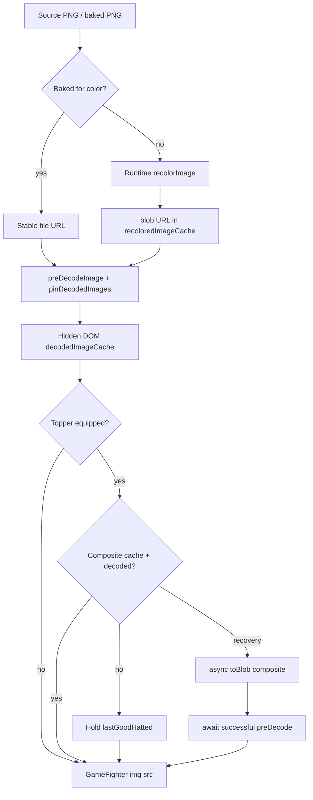
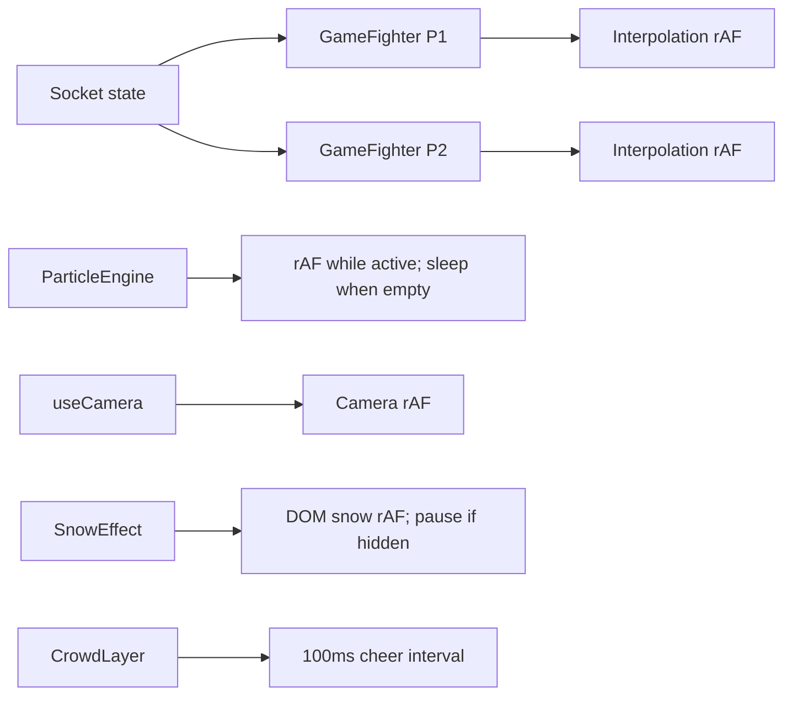
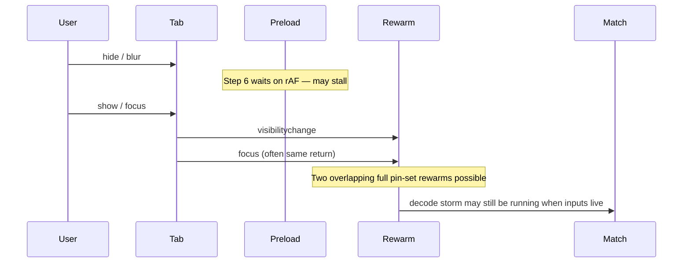
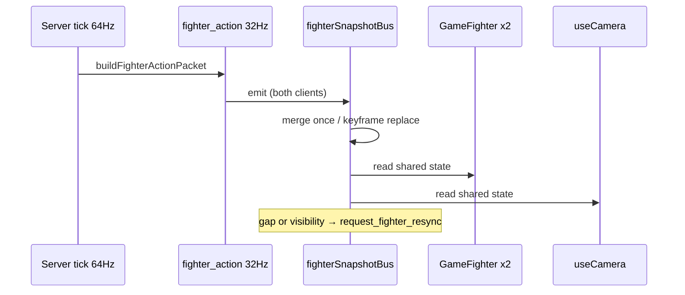

# PUMO PUMO ! — Performance Architecture

**Updated through Phase 5:** Phases 0–4 as before; Phase 5 `fighter_action` seq/simTime/keyframes, client snapshot bus + visibility resync, synthetic room-load harness.

---

## 1. Asset lifecycle (Phase 1)

### Identity after Phase 1

| Kind | Identity | Stability |
| --- | --- | --- |
| Baked body | `/baked/<hash>.png` | Stable across sessions |
| Runtime recolor | blob URL per generation | Churns; revoke on eviction |
| Topper composite | **blob URL only** (async `toBlob`); live path cache-read | Count-capped; decode required before handoff |
| Decode cache key | URL string | Failed srcs tracked separately — not “ready” |

### Phase 2 status

- Supported catalog toppers: **build-time flattened WebPs** via `manifest.hats`.
- Combat resolve: `resolveHattedSpriteSync` → baked URL first (identity from original body stem).
- Decoded cache: count cap **and** soft **384 MB** byte budget (non-pinned).
- Still open: Electron recolor worker (mostly moot when bake hits); atlas packing if depot size requires; flash tints remain runtime.

### Target (Phases 1–2)

- Match path: only **pre-existing, decoded, stable** handles (baked files or atlas entries).
- No `toDataURL` / full-size compose / recolor while inputs are live.
- Asset states: `unloaded | loading | decoded | failed | disposed`.
- Byte budgets + refcount/ownership; single creator per tuple.
- Custom colors: async generation **outside** combat.

---

## 2. Rendering lifecycle (as-is)

- Presentation is still split across many independent rAF/interval owners.
- Fighter visuals are DOM `` + CSS transforms/filters.
- Particles: 3 canvases, DPR capped (~1.5), pool 500; render idle-skips clears; **Phase 3** cancels rAF after a committed empty frame and wakes on `spawn`/`emit`.
- Snow: DOM flakes; **Phase 3** pauses while `document.hidden`.
- React state in `GameFighter` drives a large portion of visual updates.

### Still future (after packaged profiles)

- One presentation clock; simulation stays server-authoritative.
- Single socket ingest → normalized match store → both fighters read computed presentation.
- Hot transforms outside React where measured beneficial.

---

## 3. Visibility / focus lifecycle (as-is)

### Phase 1 status

- Logical readiness ≠ visual frames: **done** (`awaitDecodedReadiness`, no rAF).
- On hide: release held inputs: **already present** in `Game.jsx`.
- On show: coalesce + single-flight rewarm: **done** (50ms coalesce + shared Promise).
- Still open for later phases: rebase interpolation / full-state network resync (Phase 5); covering transition gated on critical set beyond current preload.

---

## 4. Network / snapshot lifecycle (Phase 5)

| Property | Current |
| --- | --- |
| Sim | 64 Hz authoritative |
| Remote broadcast | 32 Hz deltas (Socket.IO reliable ordered) + keyframe every 64 broadcasts |
| Local solo | 64 Hz |
| Packet metadata | `seq`, `simTime`, `isDelta`, `isKeyframe`, optional `isResync` |
| Client | Shared `fighterSnapshotBus` merge once per packet; per-fighter interp buffers |
| Visibility return | Image rewarm + `request_fighter_resync` (full snapshot to requester) |
| Capacity | Synthetic serialize harness (`npm run perf:server-load`); live soak still TBD |

### Still future (after live soak)

- Process sharding only if live capacity requires it.
- Optional single socket owner fan-out (merge already once).

---

## 5. Cache ownership and memory budgets (target)

| Pool | Budget model | Notes |
| --- | --- | --- |
| Critical match set | Pinned, sized by **bytes**, match-scoped | Bodies + toppers + tints needed this bout |
| Optional / rare | Soft cache, evictable | Rituals, gyoji variants |
| Audio SFX | Decoded AudioBuffers | Short, latency-critical |
| Music | Streamed / media element (**Phase 4**) | Battle tracks: OGG + HTMLAudioElement crossfade; short eeshi still AudioBuffer |
| Backgrounds | Display-tier WebP (**Phase 4**) | `game-map-444.webp` 3840×2560; PNG master kept for re-encode only |

Phase 0 adds approximate decoded-byte reporting via `getCacheStats()` when images have `naturalWidth/Height`.

---

## 6. Instrumentation surface (Phase 0)

| API | Purpose |
| --- | --- |
| `?perf=1` / `localStorage.pumo_perf` | Enable recorder |
| `Ctrl+Shift+P` | Overlay |
| `window.__PUMO_PERF.dump()` | Full JSON dump |
| `window.__PUMO_GHOST.summary()` | Ghost heuristic summary |
| Marks | `preload.step6`, `hat.*`, `rewarm.*`, `ghost`, `fighter.present`, `lifecycle` |

Scenarios: `client/scripts/perf/scenarios.json`.

---

## 7. Phase gate

Architecture targets above are **design commitments**, not implemented changes. Implementation proceeds only through authorized phases (1→5) with before/after measurements in `PERFORMANCE_AUDIT.md`.
