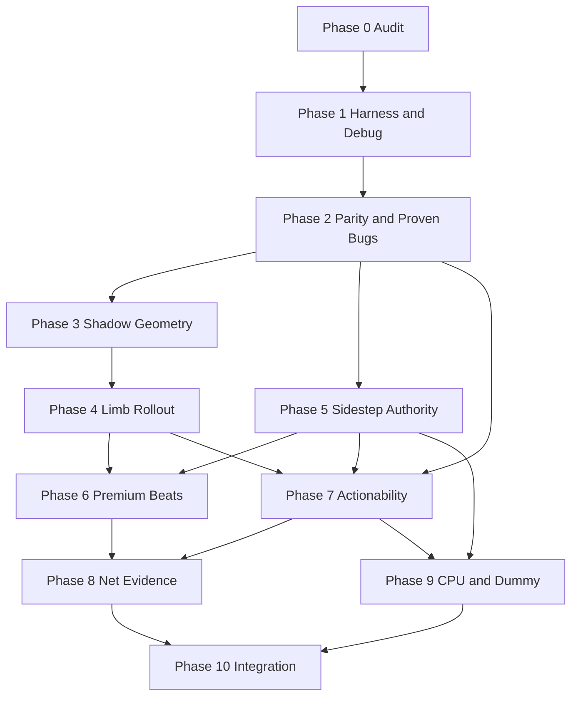

# PREMIUM COMBAT FOUNDATION — PHASE 0 ROADMAP

**Status:** Phase 0 roadmap after source-verified audit  
**Companion:** `PREMIUM_COMBAT_FOUNDATION_AUDIT.md`

This roadmap recommends the **smallest sequence that produces the largest felt improvement**, adjusted for what the current workspace already solved.

---

## Executive recommendation

Current stack: tip-rail strikes, hitstop/input freeze, lifecycle/facing ownership, rope-jump V2, offensive-aerial contracts, clinch harness. Remaining gaps listed at audit time:

1. **Invisible / dishonest sidestep** (timing, direction, destination truth)  
2. **No whiff-punishable limbs** despite readable extended recovery art  
3. **Dead recovery-cancel promise** (intent unresolved)  
4. **Presentation under-selling real Plant/Open lockouts**  
5. **Easy CPU is a lab dummy in the consumer slot**

Tip rails stay; authored hurt volumes sit around them. Sidestep outcome truth before extra VFX.

### Adjustment vs master phase map

| Master phase | Adjustment from current source |
|---|---|
| 0 Audit | **Done** (this pair of docs) |
| 1 Harness + debug volumes | Keep first — still missing |
| 2 Parity / proven bugs | Keep — 320/400, direction wire, CPU 940, recovery-cancel decision are all still live |
| 3 Shadow geometry | Keep — no authored hurt system yet |
| 4 Limb rollout | **Done** — slap + palm shipped, flag default ON (4C closeout) |
| 5 Sidestep authority | Keep, but **raise urgency**: many sidestep defects are already proven; Phase 2 should fix *presentation parity only*, Phase 5 owns physical outcomes |
| 6 Premium beats | Keep after 5 + Plant trace; Plant is likely presentation-first |
| 7 Actionability | Keep — distributed gates still real; recovery-cancel decision feeds this |
| 8 Net/determinism evidence | Keep — no full replay harness yet; **do not** jump to rollback |
| 9 CPU / dummy split | Keep — Easy slap dummy still consumer-facing |
| 10 Integration | Keep last |

**Optional compression (only if user wants fewer gates later):** Phase 2 CPU boundary fix is tiny and could ride with Phase 2 sidestep parity without expanding into AI retune. Do not merge Phase 4+5 or 5+6.

---

## Phase sequence (authority impact)

| Phase | Deliverable | Authority impact | Felt payoff |
|---|---|---|---|
| **0** | Audit + roadmap | Docs only | Orientation |
| **1** | Deterministic harness + geometry primitives + debug volume overlay | None | Enables safe work |
| **2** | Sidestep VFX/payload parity; recovery-cancel **decision**; CPU 935 | Narrow; cancel needs approval | Immediate honesty |
| **3** | Authored volumes in **shadow mode** | None | Visible truth in debug |
| **4** | Whiff-punishable limbs (feature-gated rollout) | High | Major competitive feel |
| **5** | Sidestep route / overlap / settle / evade truth | High | Major movement trust |
| **6** | Bounded beats: confirmed evade + Plant/Open read | Presentation (+ any new hitstop separately justified) | Mastery readability |
| **7** | Capability queries + cancel matrix hardening | Narrow, test-led | Fewer “why didn’t that come out?” bugs |
| **8** | Determinism / latency / reconcile evidence | Measurement + focused fixes | Online trust |
| **9** | Lab dummy vs consumer Easy; legal CPU | CPU only | Product honesty |
| **10** | Integration, flag retirement, regression | Consolidation | Ship readiness |

---

## Phase 0 complete criteria

- [x] Current tick order, rates, owners mapped from source  
- [x] Leads reconfirmed or disproven  
- [x] Action / volume / invuln / prediction matrices drafted  
- [x] Sidestep + Plant + CPU traces written  
- [x] MUST / SHOULD / DEFER ranked  
- [x] `PREMIUM_COMBAT_FOUNDATION_AUDIT.md` created  
- [x] `PREMIUM_COMBAT_FOUNDATION_ROADMAP.md` created  
- [x] No production gameplay edits  

---

## Phase 1 — Deterministic safety harness and combat-volume debug

**Status:** Approved  
**Goal:** Observe and test invisible rules without changing winners.

**HIT-phase policy (completion pass):** Client wire lacks `attackStartTime` / reliable phase flags. Overlay shows offensive HIT only for exact active (local pose-director hint or authoritative phase flags). Uncertain committed strikes omit HIT (never approximate recovery as HIT). Exact dual-slot / charged active needs Phase 2/3 phase payload — not a production delta in Phase 1.

### Build

- Dependency-free geometry primitives (`server-io/combatGeometry.js`)
- Vocabulary (`server-io/combatVolumeVocabulary.js`)
- Diagnostic inert volume query (`server-io/combatVolumeQuery.js`) — never on live tick
- Scenario harness (`server-io/test/foundation/helpers/scenarioHarness.js`)
- Characterization + geometry tests (`server-io/test/foundation/*.test.js`)
- `CombatFidelityDebug` volume overlay (local derive; `pumo_combat_volumes_debug`)

### Required scenarios (characterization of **current** live behavior)

Idle, pushbox walk-in, slap/palm/charged/low-kick/grab/dodge/sidestep phases, cross-up, same-center, both edges, size mults, hitstop freeze, reset/rematch — covered in foundation tests.

### Acceptance

Live outcomes unchanged; debug aligns to roots/mirrors; repeated traces match; debug-off cost negligible; no production delta fields.

### Stop

`PUMO PREMIUM COMBAT FOUNDATION — PHASE 1 GATE`

---

## Phase 2 — Proven contract bugs and client/server parity

**Status:** Implemented (awaiting gate approval)  
**Goal:** Fix small proven contradictions before geometry or sidestep redesign.

**Authoritative recovery decision:** Recovery remains **uncancellable**. Dead 100 ms dodge/sidestep-cancel branch removed; `canPlayerDash` / `canPlayerSidestep` unchanged.

### A. Sidestep presentation parity (no gameplay timing change)

- [x] Client active trail uses 400 ms (server `SIDESTEP_ACTIVE_MS`); no 320 assumption  
- [x] `sidestepDirection` on `DELTA_TRACKED_PROPS` (neutral `0` clears)  
- [x] VFX uses travel direction, never facing; phase-flag gated emission  
- [x] Tests: travels, facings, cross-up, delta/keyframe, interrupt, rematch  

### B. Recovery cancel contradiction

- [x] User decision: uncancellable  
- [x] Dead `recoveryAge > 100` / `allowDodgeCancelRecovery` removed  
- [x] Characterization tests for full recovery window  

### C. CPU boundary drift

- [x] `cpuAI.js` uses `GAME_MAP_LEFT` / `GAME_MAP_RIGHT` (340 / 935)  
- [x] Focused edge test; Easy dummy untouched  

### D. Payload cleanup only as required by A–C

### Phase 3 prerequisite (carried)

- Phase 1 two-resolution combat-volume visual checklist remains pending if not completed in match inspection.

### Acceptance

No move timing changes; recovery uncancellable; sidestep VFX follows travel + 400 ms; CPU edges use 935.

### Stop

`PUMO PREMIUM COMBAT FOUNDATION — PHASE 2 GATE`

---

## Phase 3 — Authored combat geometry in shadow mode

**Status:** Implemented (awaiting gate approval) — definitions **provisional** until in-match overlay inspection  
**Goal:** Intentional physical meaning per important pose without changing live hits.

### Ownership

| Role | Owner |
|---|---|
| Definition SoT | `shared/combatVolumeAuthored.json` (static data only) |
| Server adapter | `combatVolumeAuthoredLoad.js` → `combatVolumeDefs.js` |
| Server query | `queryAuthoredCombatVolumes` |
| Shadow compare | `combatVolumeShadow.js` (on-demand; **not** in tick) |
| Flag | `COMBAT_VOLUME_SHADOW` default OFF; client `pumo_combat_volume_shadow` |
| Client Vite adapter | `combatVolumeAuthoredViteBind.js` (JSON default export) |
| Client debug logic | `combatVolumeAuthoredClient.js` (bind + derive) |
| Overlay projection | World layer `#pumo-combat-volume-world` under `.game-actors` (camera-synced); HUD stays screen-fixed |

### Initial authored slice

1. Neutral / crouch body  
2. Slap startup / active / **visible recovery limb**  
3. Palm (own data — verified lifecycle)  
4. Charged tip-rail **visualization** only (contact resolver untouched)  
5. Sidestep occupancy viz only  

### Preserve

Tip rail, park, seam, charged earliest contact, clinch, rope V2, aerial outcome contracts.

### Phase 4 readiness

**Not ready** until visual verification at 1920×1080 and 1280×800 completes (carried from Phase 1/2 pending checklists).

### Stop

`PUMO PREMIUM COMBAT FOUNDATION — PHASE 3 GATE`

---

## Phase 4 — Whiff-punishable limbs (gated rollout) — **COMPLETE**

**Goal:** Extended recovery limbs become honest hurt targets; HIT only during active.

### Status

| Gate | Status |
|---|---|
| 4A slap active + recovery limbs | **Accepted** (live feel approved) |
| 4B palm active + held-out recovery limb | **Accepted** (live feel approved), checkpoint `3b8ed5bb` |
| 4C flag graduation + closeout | **Complete** |
| Limb-only torso-park / forward suction | **Repaired** — limb-only never parks to tip-meets-body |
| Flag default | **ON** since 4C; explicit `0`/`false`/`off`/`no` is the exact legacy rollback |
| Full post-4C regression | Server 1279/1279, client 164/164 |

### Rollout outcome

1. Slap hurt targets — shipped
2. Slap visible-recovery limb — shipped
3. Palm (active + held-out recovery) — shipped in 4B
4. Low kick — **not revived.** `LOW_KICK_ENABLED = false`; `executeLowKick` early-returns and both call sites are gated. No geometry, no future rollout target.
5. Charged — compatibility only. Charged may *strike* a supported exposed slap/palm limb; it gets **no** victim-limb family of its own.

One feature flag (`AUTHORED_SLAP_HURTBOX_V1`) governs both surfaces. Once-only contact; order-independent; no region damage minigame.

### Authority invariant established in 4B

`bodyEligible` (may this hit commit, including open-hit grace) is **separate** from `torsoEligible` (does the rail physically reach the torso this tick). Limb-only classification and `skipTorsoPark` derive from `torsoEligible` only. Conflating them mislabelled genuine limb hits as torso-plus-limb, which suppressed the struck-limb hold and applied ~12 units of forward suction.

### Qualification rule for any future limb family

A move qualifies only if its art materially extends a distinct appendage beyond ordinary body authority, that appendage stays independently exposed for a legible interval, an opponent's legitimate strike can intersect it while missing the torso, body authority creates a real visual/physical mismatch, the server can derive lifecycle/phase/facing/geometry honestly, and the region improves honesty rather than merely punishability.

**Audited and excluded (4C):** charged headbutt and butt slam (whole body travels; body/landing authority is correct), rope jump and offensive aerials (separate whole-body aerial/landing authority), grab/clinch/throw (own interaction system), sidestep/dodge/parry/crouch/movement (sidestep is intangible; no exposed appendage), low kick (disabled), projectiles/power-ups (may hit a supported limb; not a victim-limb family). The authored catalog carries `HURT_LIMB` only on slap and palm poses.

### Stop

`PUMO PREMIUM COMBAT FOUNDATION — PHASE 4C ROLLOUT AND CLOSEOUT GATE` — Phase 4 closed. Default-ON soak continues; the flag is intentionally retained for rollback and is **not** removed in this phase.

---

## Phase 5 — Sidestep physical resolution and destination safety

**Goal:** Every sidestep ends in a legal, readable position with an explicit outcome.

### Outcome model (names may match project style)

- CLEAN_PASS  
- PASS_WITH_SETTLE  
- BLOCKED_SHORT  
- EDGE_CONSTRAINED  
- INTERRUPTED  
- NO_TARGET (if applicable)  

### Non-negotiables

No illegal final overlap; no side-pop without readable path; one owner for tangible handoff; no generic pushbox double-correct same tick; no teleport through ring; stable intended-side state (not noisy last-frame root compare); confirmed-evade semantic event **without** spectacle yet.

### Stop

`PUMO PREMIUM COMBAT FOUNDATION — PHASE 5 GATE`

---

## Phase 6 — Premium interaction beats

**Goal:** Emphasize trustworthy outcomes; never hide bad mechanics.

### Priority beats

1. **Confirmed sidestep evade** (uses Phase 5 event)  
2. **Plant / Perfect Brace Open** — align visuals to existing 320/400 ms; no stacked cooldown unless actionability bug proven  
3. At most one more high-value beat (grab tech / jolt / matador / posture break) after ranking  

Budget: no additive slow-mo spam; one event ID → one beat; reduced-effects path.

### Stop

`PUMO PREMIUM COMBAT FOUNDATION — PHASE 6 GATE`

---

## Phase 7 — Actionability and cancel-contract hardening

**Goal:** Same legal question on every input path (human + CPU) without an FSM rewrite.

- Capability queries with dev rejection reasons  
- Lifecycle instance ownership on touched moves  
- Dev/test impossible-state assertions  
- Encode Phase 2 recovery-cancel decision consistently  

### Stop

`PUMO PREMIUM COMBAT FOUNDATION — PHASE 7 GATE`

---

## Phase 8 — Determinism, latency, reconciliation evidence

**Goal:** Measure online trust; repair focused payload/prediction bugs only.

- Extend traces; network-condition matrix; both client roles  
- Recommend rollback **only** if measured failure demands a separate charter  
- No new net library in this program by default  

### Stop

`PUMO PREMIUM COMBAT FOUNDATION — PHASE 8 GATE`

---

## Phase 9 — CPU and training-opponent legitimacy

**Goal:** Keep slap/grab dummies as **explicit lab fixtures**; consumer Easy plays full legal game imperfectly.

- Same capability contract as humans  
- Authoritative boundaries / volumes  
- Seeded decision tests + finite soak  

### Stop

`PUMO PREMIUM COMBAT FOUNDATION — PHASE 9 GATE`

---

## Phase 10 — Integration and final gameplay gate

**Goal:** Enable approved flags, remove obsolete dual paths, full allowed regression, honest remaining-risk report.

No new mechanics. No prohibited pipelines.

### Stop

`PUMO PREMIUM COMBAT FOUNDATION — FINAL GAMEPLAY GATE`

---

## Ranked worklist (cross-phase)

### MUST (blocks “legitimate fighter” feel)

| ID | Item | Phase |
|---|---|---|
| M1 | Sidestep active 400↔320 + travel direction honesty | 2 |
| M2 | Sidestep destination/pass/edge/settle outcomes + tests | 5 |
| M3 | Recovery-cancel intent resolved + tested | 2 → 7 |
| M4 | Shadow then gated limb hurt volumes for slap recovery | 3 → 4 |
| M5 | Separate Easy lab dummy from consumer Easy | 9 |
| M6 | CPU boundary 935 everywhere | 2 |

### SHOULD

| ID | Item | Phase |
|---|---|---|
| S1 | Debug combat volumes | 1 |
| S2 | Deterministic scenario harness | 1 → 8 |
| S3 | Plant/Open presentation beat | 6 |
| S4 | Confirmed-evade beat | 5 → 6 |
| S5 | Shared capability queries | 7 |
| S6 | Order-independence tests | 1/5/8 |

### DEFER

Rollback library, physics engine, full boolean FSM rewrite, UI/BASHO/Steam/art pipelines, low-kick tip work while disabled, broad balance pass, replacing tip rails with pure boxes.

---

## Dependencies graph

Phase 5 does **not** require Phase 4, but Phase 6 evade beat requires Phase 5. Phase 4 does not require Phase 5. Parallelism after Phase 2 is possible for 3→4 vs 5 if staffing allows; do not merge patches.

---

## Verification policy (every implementation phase)

**Allowed:** focused `node:test`, focused client unit tests, local ESLint on touched client files, read-only audit scripts, existing harnesses, `git diff --check`, manual `dev:web` when required.

**Prohibited:** `npm run build`, Vite/Electron/Steam packaging, `npm install` / npx package fetch, asset bake/recolor pipelines, `git add` / `git commit` / `git push`.

**Claims:** never claim playtest without observing it; passing tests ≠ feel proof.

---

## Feature-flag policy

- Flags only for materially risky authority changes (limb rollout, sidestep outcome cutover, etc.)  
- Default preserves legacy until manual approval  
- Document exact rollback env/command  
- Remove obsolete flags only in Phase 10  

---

## Manual playtest backlog (pending human)

Not executed in Phase 0. Highest priority when authorized:

1. Sidestep both directions at center / both edges / vs moving opponent / size mismatch — watch final side and pops  
2. Whiff slap at max range — does recovery arm look punishable? (today: visually yes, mechanically no)  
3. Plant resist + Perfect Brace — can thrower re-tech during Open? Does pose read the full 320/400 ms?  
4. Shift during post-hit recovery after 100 ms — confirm dodge does **not** cancel today  
5. VS CPU Easy — confirm slap-only dummy  
6. Local vs remote slap confirm under moderate delay  

---

## Document ownership

| Doc | Role |
|---|---|
| `PREMIUM_COMBAT_FOUNDATION_AUDIT.md` | Source-of-truth snapshot for this program |
| `PREMIUM_COMBAT_FOUNDATION_ROADMAP.md` | Phase gates and ranked plan |
| Historical `COMBAT_FIDELITY_*` / phase reports | Prior art; verify before reuse |
| Master mega prompt | Charter + invariants; does not override fresher audit facts |

Update audit/roadmap when a phase changes the contract. Do not rewrite historical phase markdown.

---

## Phase 0 final recommendation (short)

Execute **1 → 2 → (3→4) and (5) → 6 → 7 → 8 → 9 → 10**.  
Largest early felt wins after the harness: **sidestep honesty (2+5)** and **limb punish (3+4)**.  
Treat Plant as **presentation** until proven otherwise.  
Keep tip rails. Keep rope/aerial/clinch approvals. No rollback project unless Phase 8 measurements demand a new charter.
